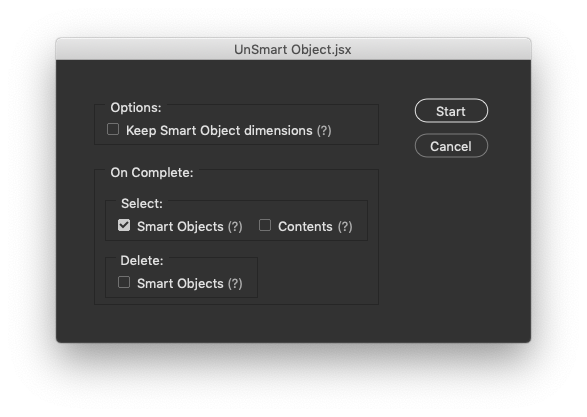
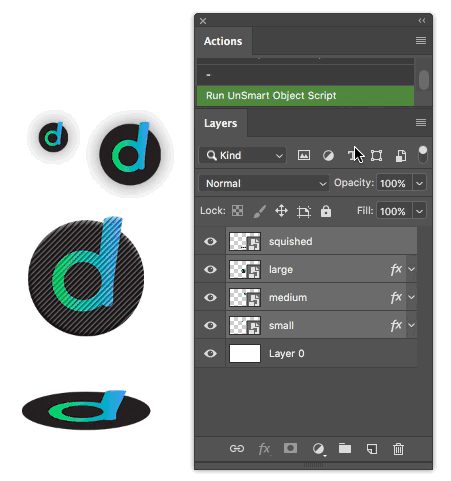

# UnSmart Object.jsx (Photoshop script)

- Ungroup one or multiple smart objects at once.
- Option to resize back to smart object dimensions _Note: this option doesn't respect aspect ratio or original dimensions of the contents._
- Ignores non-smart object layers. _Note: vector smart objects cause the script to fail._

## Dialog shortcuts

| Shortcut         | Option / action                  |
|------------------|----------------------------------|
| `1` (or `space`) | Keep smart object dimensions     |
| `2`              | Select smart objects on complete |
| `3`              | Select contents on complete      |
| `4`              | Delete smart objects on complete |
| `Enter`          | Start                            |
| `Esc`            | Close the dialog                 |

## Example

A small example where the script un-smarts multiple layers and keeps the smart object size for each.

## Good to know

- Tested in Photoshop CC 2019
- Doesn't work with vector smart objects.
- Though the script can keep the smart object size or at least tries real hard to do it... it _doesn't_ retain any other transformations, like skewing for example. It simply takes the original content and resizes that to fit the bounds of the smart object.
